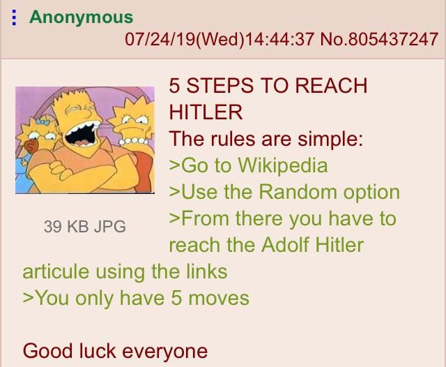

# Reach Hitler

There was a post on [r/greentext](https://www.reddit.com/r/greentext/comments/cop674/anon_plays_a_game/) about reaching Hitler in 5 steps from a random wiki. 
I had just finished my exams a few days back and so had some free time right now.
Also, I have never done web scraping before so I thought let's do it now. Hee I go!

## Installation
`pip3 install beautifulsoup4`

## Run
`python3 reach.py`
